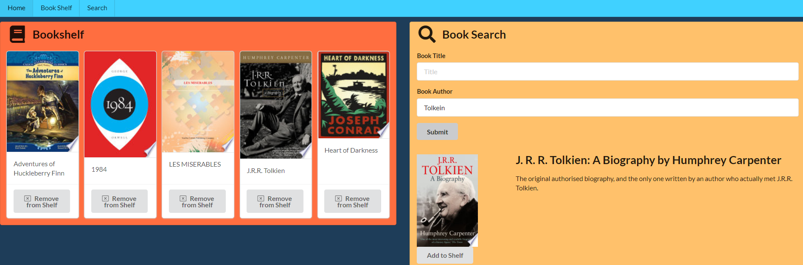

# i-bookshelf

[Deployed on Heroku!](https://i-bookshelf.herokuapp.com/)

## Introduction
i-Bookshelf is a web app that uses Google Books API to create a simple list of books. Search, Add, and Remove! Your books are stored on a database so they won't get lost! Current build saves user ID on local storage, authentication to come!

## How it Works

### MERN

#### MongoDB
Mongo is the NoSQL database used in this project. Object-oriented data documents are stored on Mongo Atlas for retrieval by user, via axios, based on the user's ID, which is stored on local storage.

#### Express
Express is the hosting NPM that allows the React front-end to communicate to back-end APIs. It creates those APIs, models, and links to the Mongoose Database.

#### React
React is a front-end, virtual DOM served to users by its own service. It allows for complete JS-based development using JSX instad of creating then manipulating DOM elements in front-end JS. React uses Axios to perform CRUD operation requests on the iBookshelf API and Google Books API. Each element, or Component, can be designed independantly as "functional components".

#### Node
Node is the service that allows JavaScript to be used for non-browser functionality, specifically within terminal, which allows for libraries, or NPMs, to control other services, like MongoDB, React, etc.

### Google Books
Google Books API is an open book-search tool that delivers results based on user input. No API KEY requrired for open information!

### Local Storage
User ID is stored on local storage for now, instead of authentication.

## Future Dev

1. Authentication: It is ideal that, isntead of storing info on local storage, the user can log-in using some form of authentication. If local storage is deleted, or a new browser used, the user has no way to retrieve the "account".

## Credits

* Erik Portillo, 2021